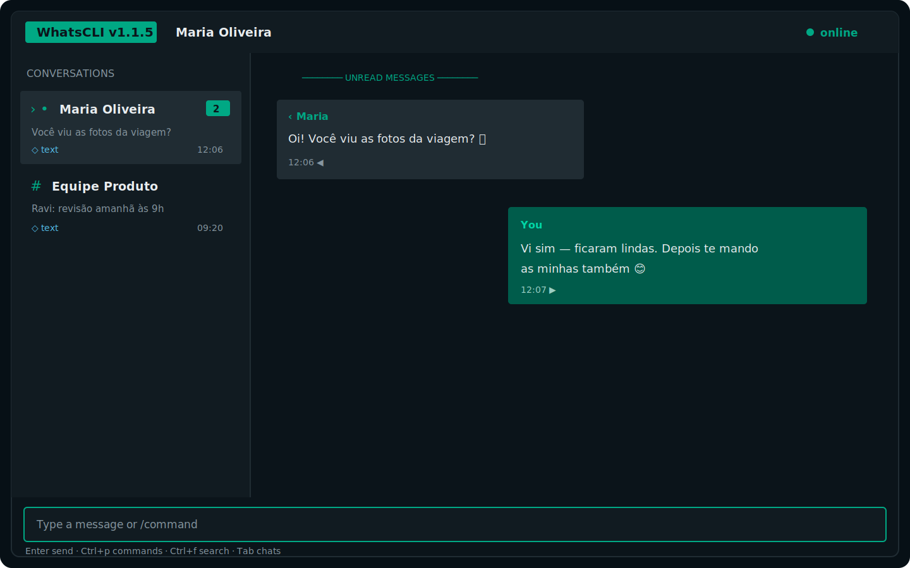

# WhatsCLI RS

WhatsCLI RS is a modern Rust port of
[normen/whatscli](https://github.com/normen/whatscli), rebuilt around a responsive,
keyboard-first terminal interface. It uses
[`whatsapp-rust`](https://github.com/jlucaso1/whatsapp-rust) for the multi-device protocol and
Ratatui/Crossterm for the interface.



> WhatsCLI is an unofficial client. Using third-party WhatsApp clients may violate WhatsApp's
> terms and can result in account suspension. Use it at your own risk.

## Features

- QR-code login with an encrypted, persistent multi-device session
- Live messages and history synchronization for contacts and groups
- Text, image, video, audio and document send/download support
- Read receipts, unread counters, message info, URL opening and revocation
- Group creation, leave, subject changes, member add/remove and admin changes
- Configurable colors, key bindings, desktop notifications and terminal image previews
- Safe filename handling and contact/push-name refreshes
- Responsive keyboard-first interface with message bubbles, chat search and a command palette
- Non-blocking background tasks with progress in the footer and completion/error toasts
- WhatsApp Dark, high-contrast, custom and ANSI-16 themes

## Build and install

Rust 1.97.1 is pinned by `rust-toolchain.toml`.

```bash
cargo build --release --locked
cargo install --path . --locked
```

Or use the Makefile:

```bash
make test
make build
make install
```

On first launch, scan the QR code with **WhatsApp → Linked devices → Link a device**.

### Migrating from the Go release

The old Go session database cannot be reused because the native Rust protocol backend has a
different encrypted storage schema. The first Rust launch asks for a one-time re-pair and stores
the new session in `~/.config/whatscli/session-rust.db`. The existing `whatscli.config` remains
compatible and is loaded without changes.

## Usage

The default global keys are:

| Key | Action |
| --- | --- |
| `Tab` | Switch between input and chats |
| `Ctrl+w` | Focus the message panel |
| `Ctrl+Space` | Focus input |
| `Ctrl+e` | Focus chats |
| `Ctrl+f` | Search conversations incrementally |
| `Ctrl+p` | Open the searchable command palette |
| `Ctrl+b` | Load older messages |
| `Ctrl+n` | Mark the selected chat read |
| `Ctrl+r` | Connect |
| `Ctrl+q` | Quit |
| `Ctrl+c` / `Ctrl+v` | Copy/paste a selected user ID |

In the message panel, use arrows or `j`/`k` to select a message. The defaults are `d` download,
`o` open, `s` show image, `u` open URL, `i` info and `r` revoke.

Commands use `/` by default:

```text
/connect                 connect to WhatsApp
/disconnect              close the connection
/logout                  unlink this device
/reset                   unlink and remove the Rust session database
/backlog                 request older messages
/read                    mark the current chat read
/upload /path/file       send a document
/sendimage /path/file    send an image
/sendvideo /path/file    send a video
/sendaudio /path/file    send audio
/leave                   leave the current group
/create [jid ...] name   create a group
/subject new name        change the group subject
/add jid ...             add members
/remove jid ...          remove members
/admin jid ...           promote members
/removeadmin jid ...     demote members
/colorlist               show supported terminal colors
```

Use `/help` in the app for keys and `/commands` for the command list.

The composer supports cursor movement with `Left`/`Right`, `Home`/`End`, and safe
`Backspace`/`Delete` editing for emoji and accented text. `Esc` closes the active overlay first,
then returns focus to the composer.

## Configuration

Configuration is stored at `~/.config/whatscli/whatscli.config`. Missing files are created with
defaults. The legacy INI sections and keys (`general`, `keymap`, `ui`, `colors`) are preserved.

Images can be rendered through an external command such as `jp2a`; configure `show_command`.
Downloads and previews use `download_path` and `preview_path`. Desktop notifications are enabled
with `enable_notifications = true`, or use `use_terminal_bell = true`.

History and logging settings live in `[general]`:

```ini
[general]
history_sync_limit = 200  ; automatic limit per conversation; 0 is unlimited
log_level = info          ; error, warn, info, debug, or trace
log_retention_days = 7    ; daily files retained; minimum 1
```

Automatic history synchronization keeps only the most recent `history_sync_limit` messages in
each conversation to bound permanent memory use. `/backlog` requests produce `ON_DEMAND` batches,
which are never truncated by this automatic limit and can extend the selected conversation
explicitly. The unread count remains the server-provided value even when older unread messages are
outside the local window.

Logs are written to `~/.config/whatscli/logs/whatscli.YYYY-MM-DD.log`, rotate daily and retain the
configured number of files. Logs contain event types, states, queue measurements, history counts,
durations and errors, but never QR contents, JIDs, contact names, message text, media URLs or raw
protocol payloads. Invalid `log_level` values fall back to `info` with a warning.

The optional UI settings are:

```ini
[ui]
theme = whatsapp-dark       ; whatsapp-dark, high-contrast, or custom
color_mode = auto           ; auto, truecolor, or ansi16
wide_breakpoint = 100
compact_breakpoint = 72
short_height = 18

[keymap]
open_palette = Ctrl+p
search_chats = Ctrl+f
```

At 100 columns and above, conversations include a preview, time and unread badge. Between 72 and
99 columns the sidebar is condensed; below 72 columns, `Tab` switches the single visible panel.
Legacy configuration files still load unchanged. If their old color values are untouched, the new
`whatsapp-dark` theme is applied in memory. Existing color customizations select `custom` in memory;
WhatsCLI never rewrites an existing configuration file silently.

## Architecture

- `src/app.rs`: event routing, commands, selection and configurable key bindings
- `src/ui/`: responsive Ratatui components, semantic themes and grapheme-safe editor
- `src/session.rs`: background supervisor, categorized workers, WhatsApp session and integrations
- `src/storage.rs`: exclusive storage actor, in-memory model and coalesced UI snapshots
- `src/config.rs`: XDG paths and backwards-compatible INI configuration
- `src/qr.rs`: terminal QR rendering

The Ratatui loop only handles input, visual state and drawing. A Tokio supervisor owns the protocol,
session, per-conversation, history, transfer and system-integration workers. User-initiated work
stays on bounded queues whose saturation is reported immediately, while the ordered protocol event
queue does not discard connection, message or history events during bursts. The in-memory database is
owned exclusively by a storage actor, which coalesces consistent conversation/message snapshots
before sending them to the UI. Synchronous clipboard, opener, notification and preview APIs run in
Tokio's blocking pool.

The footer shows the most recently active background task and `+N` when other tasks are running.
On exit, WhatsCLI stops accepting new work, disconnects the client, drains workers for up to three
seconds, cancels anything still pending and then restores the terminal.

See [CHANGELOG.md](CHANGELOG.md) for user-visible and architectural changes.

## License

MIT. See [LICENSE](LICENSE).

## Credits

- Original WhatsCLI project by [normen](https://github.com/normen)
- Rust port and modern interface by [Pir0c0pter0](https://github.com/Pir0c0pter0)
